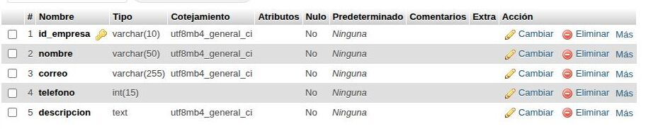

# Planteamiento del problema

Las empresas que necesitan servicios especializados de geología pueden tener dificultades para encontrar profesionales que sean adecuados para los proyectos que desean realizar. Cuando una empresa necesita un geólogo, es importante que pueda conocer previamente sus conocimientos, especialidades, servicios y experiencia profesional, ya que esta información le permite determinar si el profesional cuenta con las capacidades necesarias para el trabajo que requiere.

Uno de los problemas que se presenta es que las empresas no siempre cuentan con un medio sencillo y organizado en el que puedan consultar la información de los geólogos disponibles. La información sobre un profesional puede encontrarse de manera poco organizada o no estar disponible en un espacio donde la empresa pueda revisarla fácilmente.

Esta situación puede dificultar el proceso de búsqueda, ya que la empresa necesita conocer las características profesionales del geólogo antes de decidir si desea solicitar sus servicios. Si no existe un espacio donde se pueda consultar esta información de manera clara, puede ser más complicado identificar rápidamente a un profesional que se adapte a las necesidades de un determinado proyecto.

Además, conocer únicamente que una persona es geólogo no permite saber si sus capacidades corresponden con el trabajo que la empresa necesita. Por esta razón, resulta importante que la empresa pueda consultar información relacionada con su perfil profesional, sus especialidades, los servicios que ofrece y los trabajos o proyectos que ha realizado.

Por lo anterior, se plantea el desarrollo de una página web que permita presentar la información profesional de un geólogo de una manera clara y ordenada. La página estará enfocada en que las empresas puedan conocer el perfil del profesional, sus servicios, su experiencia y sus datos de contacto, facilitando así la búsqueda de un geólogo que pueda adaptarse a las necesidades de sus proyectos.

# Causas

Una de las principales causas del problema es la falta de espacios donde las empresas puedan consultar fácilmente los perfiles de geólogos especializados. Cuando una empresa necesita encontrar un profesional para realizar un trabajo relacionado con la geología, puede no disponer de un lugar específico donde pueda revisar la información profesional de los geólogos.

Esta falta de espacios de consulta dificulta que las empresas puedan conocer los conocimientos y capacidades de un geólogo antes de solicitar sus servicios. Al no tener esta información disponible de manera clara, la empresa puede tener dificultades para determinar si el profesional es adecuado para el proyecto que necesita realizar.

Otra causa es la falta de información organizada sobre los perfiles profesionales. Para una empresa, no solo es importante conocer que un profesional trabaja como geólogo, sino también conocer sus especialidades y los servicios que puede ofrecer. Cuando esta información no se encuentra organizada, la búsqueda de un profesional puede hacerse más complicada.

También existe una dificultad relacionada con el conocimiento de los servicios que ofrece el geólogo. Si una empresa no puede consultar de manera sencilla los trabajos o servicios que realiza el profesional, puede resultar más difícil determinar si estos se adaptan al proyecto que tiene.

Por lo tanto, las causas principales están relacionadas con la falta de un espacio donde las empresas puedan consultar de manera sencilla, clara y organizada la información profesional, las especialidades y los servicios de un geólogo.

# Consecuencias

La dificultad para encontrar información sobre geólogos especializados puede generar retrasos en el proceso de búsqueda de profesionales adecuados para los proyectos de las empresas. Cuando una empresa no puede consultar rápidamente el perfil de un geólogo, necesita más tiempo para conocer sus capacidades y determinar si puede realizar el trabajo que necesita.

Una de las consecuencias es que el proceso de contratación de un profesional adecuado puede hacerse más lento. La empresa necesita conocer la información del geólogo antes de decidir si desea solicitar sus servicios, por lo que la falta de información organizada puede dificultar este proceso.

Otra consecuencia es que las empresas pueden tener menos opciones al momento de buscar un geólogo que cumpla con sus necesidades. Si no pueden conocer fácilmente los perfiles y especialidades de los profesionales, puede resultar más complicado encontrar uno que tenga las capacidades relacionadas con el proyecto.

También puede existir dificultad para conocer la experiencia profesional del geólogo. Los trabajos y proyectos realizados anteriormente permiten que la empresa conozca mejor el tipo de experiencia que tiene el profesional. Si esta información no está disponible de manera clara, la empresa puede tener dificultades para evaluar si su experiencia se adapta a lo que necesita.

En general, estas consecuencias pueden hacer que las empresas tengan más dificultades para encontrar, conocer y contactar a un geólogo que pueda adaptarse a las necesidades de sus proyectos.

# Aporte

La página web ofrecerá a las empresas un espacio donde podrán conocer de manera clara y organizada la información profesional de un geólogo. El objetivo es que la empresa pueda consultar la información necesaria para conocer sus capacidades y determinar si sus servicios pueden adaptarse al proyecto que necesita realizar.

Uno de los principales aportes de la página será la presentación del perfil profesional del geólogo. A través de este espacio, las empresas podrán conocer información relacionada con sus conocimientos y especialidades, lo que permitirá tener una idea más clara de sus capacidades profesionales.

La página también permitirá mostrar los servicios que ofrece el geólogo. De esta manera, las empresas podrán conocer qué servicios están disponibles y determinar si estos se adaptan al trabajo que necesitan realizar.

Otro aporte será la presentación de la experiencia profesional. Las empresas podrán conocer los proyectos o trabajos realizados por el geólogo, lo que les permitirá tener una referencia sobre su experiencia profesional y evaluar si esta se relaciona con las necesidades de su proyecto.

Finalmente, la página contará con información de contacto para que las empresas puedan comunicarse con el geólogo cuando estén interesadas en solicitar sus servicios. Esto permitirá establecer un medio de comunicación entre la empresa y el profesional después de que la empresa haya revisado la información disponible.

De esta manera, la página web permitirá reunir en un mismo espacio el perfil profesional, los servicios, la experiencia y la información de contacto del geólogo, facilitando que las empresas puedan conocer su información de manera ordenada y solicitar sus servicios cuando estén interesadas.

# Épicas e historias de usuario

## Épica: Perfil profesional

Esta épica se enfoca en la información relacionada con el perfil profesional del geólogo. Para una empresa es importante conocer las capacidades del profesional antes de considerar la posibilidad de solicitar sus servicios.

La información del perfil permite que la empresa tenga una visión general del profesional y pueda conocer los conocimientos y capacidades que posee. Esto facilita que la empresa determine si el perfil del geólogo puede relacionarse con las necesidades de su proyecto.

**Historia de usuario:**

Como empresa, quiero conocer el perfil profesional del geólogo para saber si cuenta con las capacidades necesarias.

Esta historia de usuario representa la necesidad de la empresa de consultar la información profesional del geólogo antes de decidir si sus servicios pueden ser adecuados para el trabajo que necesita realizar.

## Épica: Servicios

Esta épica se encuentra relacionada con los servicios que ofrece el geólogo. La empresa necesita conocer qué servicios puede realizar el profesional para determinar si estos corresponden con las necesidades de su proyecto.

Mostrar los servicios de manera clara permite que la empresa pueda identificar cuáles son los trabajos que puede solicitar al geólogo. De esta manera, la información de los servicios complementa la información presentada en el perfil profesional.

**Historia de usuario:**

Como empresa, quiero conocer los servicios que ofrece el geólogo para saber si se adaptan a mi proyecto.

Esta historia representa la necesidad de conocer los servicios disponibles antes de solicitar el trabajo del profesional.

## Épica: Experiencia profesional

Esta épica está enfocada en la experiencia profesional del geólogo. Las empresas pueden necesitar conocer los proyectos o trabajos que el profesional ha realizado para tener una referencia de su experiencia.

La información sobre los trabajos realizados permite que la empresa conozca mejor la experiencia del geólogo y pueda evaluar si esta se adapta a las necesidades del proyecto que desea realizar.

**Historia de usuario:**

Como empresa, quiero conocer los proyectos o trabajos realizados por el geólogo para evaluar su experiencia.

Esta historia de usuario permite representar la necesidad de la empresa de conocer la experiencia del profesional antes de solicitar sus servicios.

## Épica: Información de contacto

Esta épica se relaciona con la información necesaria para que una empresa pueda comunicarse con el geólogo. Después de consultar su perfil, sus servicios y su experiencia, la empresa necesita encontrar un medio para solicitar sus servicios.

Contar con la información de contacto permite que la empresa pueda establecer comunicación con el profesional cuando esté interesada en alguno de los servicios que ofrece.

**Historia de usuario:**

Como empresa, quiero encontrar los datos de contacto del geólogo para poder solicitar sus servicios.

Esta historia representa la necesidad de disponer de los datos necesarios para establecer contacto con el profesional.

## Épica: Presentación de la página

Esta épica se enfoca en la manera en que se presenta la información dentro de la página web. Para la empresa es importante que la información del geólogo pueda encontrarse de forma clara y ordenada.

Una presentación organizada permite que la empresa pueda consultar el perfil, los servicios, la experiencia y los datos de contacto sin tener dificultades para encontrar la información que necesita.

**Historia de usuario:**

Como empresa, quiero encontrar la información del geólogo de forma clara y ordenada para conocer rápidamente sus servicios.

Esta historia representa la necesidad de que la información disponible dentro de la página sea fácil de consultar y permita conocer rápidamente los servicios del profesional.

# Modelo relacional

El modelo relacional representa la forma en que se organiza la información utilizada en la página web. Este modelo permite establecer las tablas que forman parte de la base de datos y organizar los datos correspondientes a cada una de ellas.

La utilización de un modelo relacional permite separar la información en diferentes tablas, manteniendo organizados los datos correspondientes a las empresas y las solicitudes.

Además, el modelo permite establecer conexiones entre las tablas cuando existe información que debe estar relacionada. En este caso, se estableció una conexión entre la tabla `empresa` y la tabla `solicitud`.

.jpg)

# Tabla

La primera tabla presentada corresponde a una parte de la estructura de la base de datos utilizada para la página web. Esta tabla permite organizar la información mediante diferentes atributos, de manera que cada dato pueda almacenarse en el lugar correspondiente.

La organización de la información mediante tablas permite mantener una estructura definida dentro de la base de datos. Cada atributo representa un dato que forma parte de la información que se necesita almacenar.

Esta estructura hace parte del modelo relacional planteado para el funcionamiento de la página web y permite que los datos puedan mantenerse organizados.

# Tabla (2)

La segunda tabla representa otra parte de la estructura de la base de datos. Al igual que la tabla anterior, contiene diferentes atributos destinados a almacenar la información correspondiente.

Durante la construcción del modelo relacional se realizó una modificación en esta tabla. Se decidió **retirar el atributo `ficha` de la tabla `solicitud`**, por lo que dicho atributo ya no forma parte de la estructura final planteada para esta tabla.

Este cambio permite mantener la tabla `solicitud` únicamente con los atributos que forman parte de la estructura definida para el modelo.

.jpg)

# Conexión

Dentro del modelo relacional se creó una conexión **uno a muchos** entre la tabla `empresa` y la tabla `solicitud`.

Esta relación establece que una empresa puede estar relacionada con varias solicitudes. Es decir, una misma empresa puede realizar más de una solicitud dentro de la estructura planteada.

Por otro lado, cada solicitud se encuentra relacionada con una empresa. De esta manera, las solicitudes pueden asociarse con la empresa correspondiente, permitiendo mantener una conexión entre la información almacenada en ambas tablas.

La conexión entre `empresa` y `solicitud` permite organizar los datos relacionados y establecer de manera clara la relación existente entre las empresas y las solicitudes que realizan.

La relación queda representada de la siguiente manera:

**Empresa → Solicitud**

**Una empresa puede tener muchas solicitudes.**

.jpg)